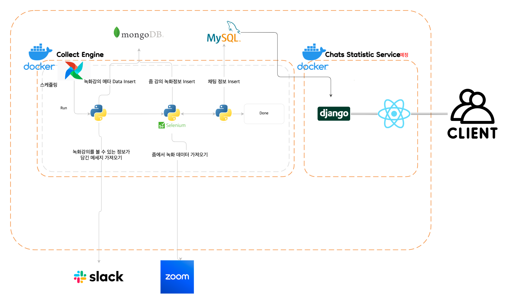
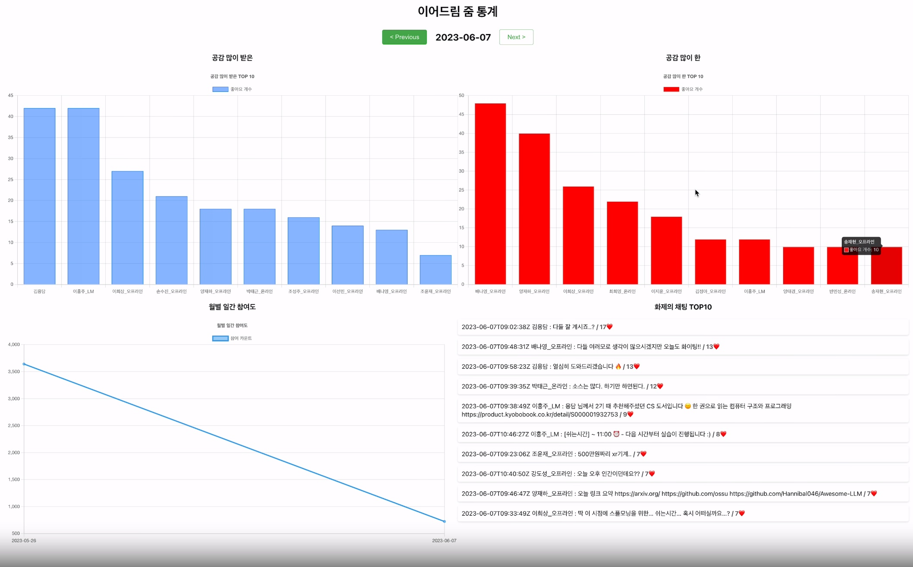
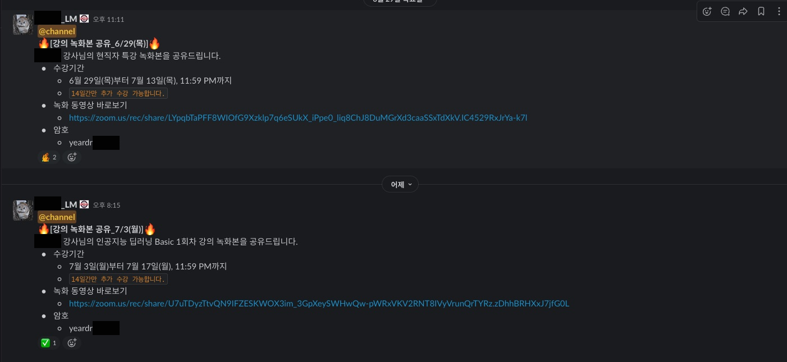
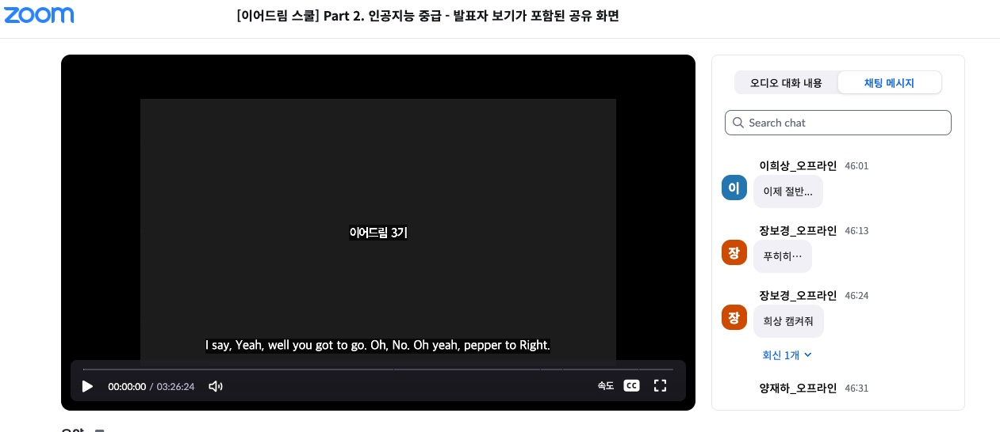
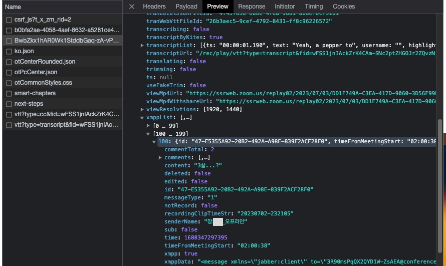
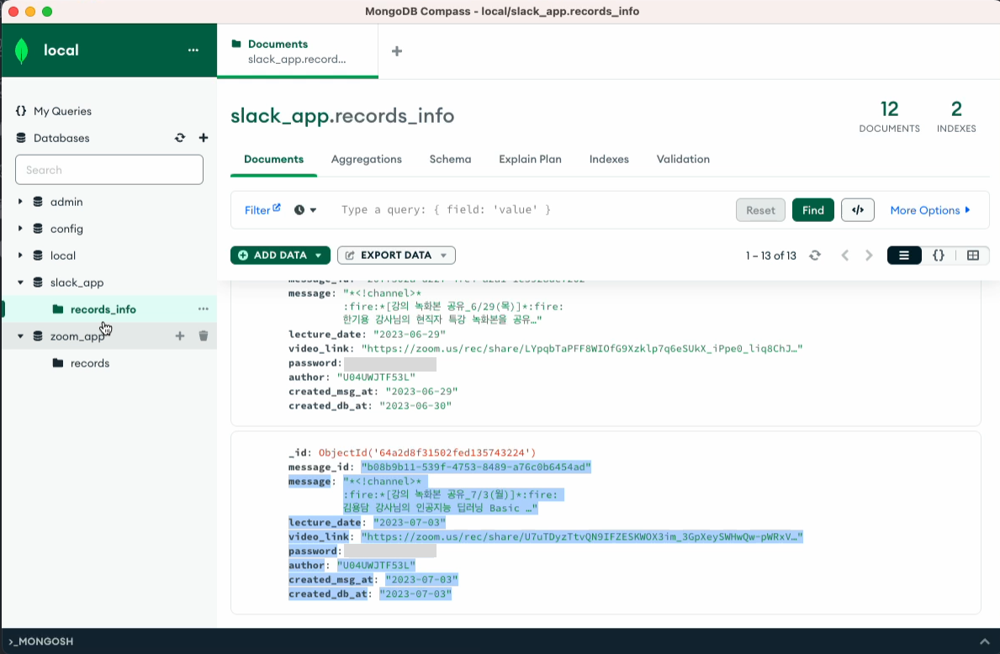
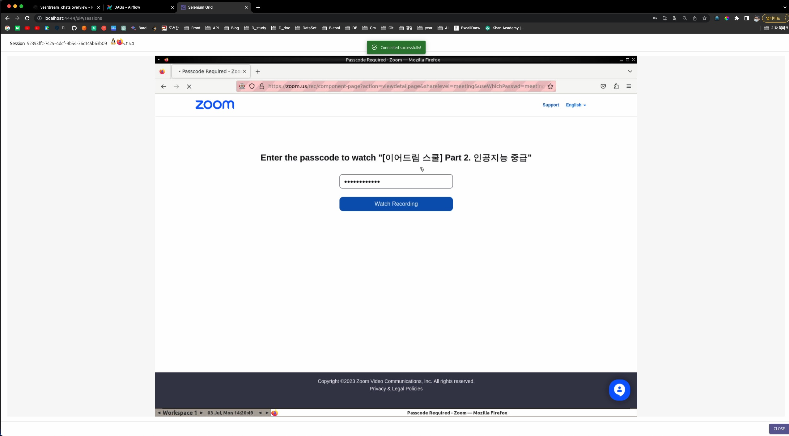
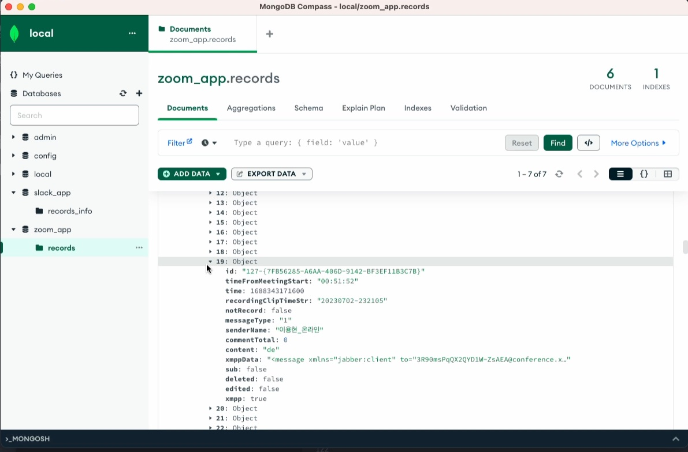
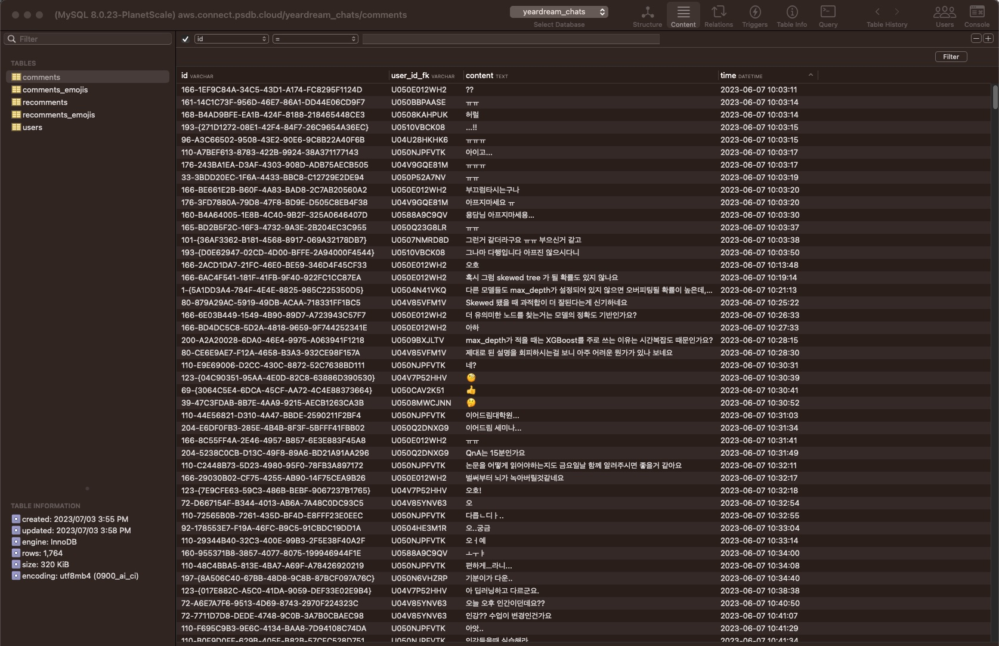

# 데이터 수집 사이드 프로젝트

이어드림 교육은 ZOOM 온라인 강의로 진행됩니다.  
학생들이 채팅을 하루에 300건 이상 입력합니다.  
학생들의 채팅 데이터를 활용하여  
서비스를 만드는 사이드프로젝트입니다.

# 동기

## 불편함

학원에서 캐글이나 프로젝트를 하다보니  
나와는 거리가 먼 문제들을 풀고 있었고  
공감할 수 있고 피부에 와닿는 변화를 만들고 싶었습니다.

## 구상

1. 데이터를 크롤링을 통해 수집할 수 있다.
2. 강의가 진행되면 데이터는 지속적으로 발생한다.
3. 서비스가 최소 한 명에게 흥미를 끌 수 있다.

세 가지를 충족시키는 서비스를 원했습니다.

### 일반 서비스

**(X축: 날짜 or 시간 ) Y축 : 채팅 참여도 **  
그래프를 그린다면, 수업 참여도를 파악할 수 있습니다.  
X축을 10분단위로 보여준다면  
강의에 질문이 있거나 중요한 부분을 유추할 수 있습니다.  

줌 채팅에 이모티콘, 채팅으로 댓글을 남길 수 있는데  
반응이 좋은 채팅 TOP10을 보여준다면  
유용한 댓글을 파악할 수 있습니다.

개인별로 지금까지 어떤 채팅을 쳤는지 보여주고  
많이 사용한 단어를 보여준다면  
흥미를 끌 수 있을 것 같습니다.

이런 서비스가 있다면 채팅 참여도를 올려  
수업 참여에 긍정적인 영향을 줄 수 있지 않을까 생각해봅니다.

### AI 서비스

더 나아가 AI 모델을 만든다면,

채팅에서 학생들이 선생님에게 "질문"을 많이 하는데  
**채팅이 질문인지 아닌지 판단하는 모델**을 만들어

강의 별로 모델이 판단한 질문을 웹 페이지에 모아두면  
학생들이 웹 페이지에 들어와서  
선생님이 어떻게 답변했는지 답글을 남김으로써  
**복습 효과**를 줄 수 있을 거라 생각했습니다.

채팅을 입력하면 누가 말했을 것 같은지 판단해주는 모델을 만든다면  
학생들의 재미를 유발할 수 있을거라 생각했습니다.

예를들어 박세훈이라는 학생은 채팅을 입력할 때  
"안녕하세욥"이라는 독특한 어투로 입력을 많이 했습니다.  
**"안녕하세욥"이라는 단어를 입력하면  
"박세훈"이 얘기했을 것 같다고 보여주는 형식**입니다.

### 특수한 상황

아주 운이 좋은 프로젝트가 될 거라 생각했습니다.  
이전에도 사이드 프로젝트를 많이 해봤지만  
사용자를 모시는 건 정말 어려웠습니다.

주변 사람들의 흥미를 끌 수 있다면  
사용자를 받을 수 있고
피드백을 받아가며 실제 문제를 해결하거나  
웃음을 줄 수 있는  
서비스를 해볼 수 있는 아주 좋은 기회라고 생각했습니다.

주변 사람들이 서비스를 찾아주면  
자연스럽게 안정적인 서비스를 고민하고  
로그, 대응, 시스템 개선을 자연스럽게 하게 될 것이라 생각했습니다.

# 구현

## 프로토타입

처음에는 프로젝트를 혼자 시작했습니다.

  
줌 앱에 채팅 저장하기 기능이 있습니다.  
.txt 파일로 저장됩니다.
일련의 규칙이 있습니다.  
분석하여 파싱하는 라이브러리를 제작했습니다.  

https://github.com/beardfriend/zoom_chatting_parser

  

데이터베이스에 입력하는 API,  
간단한 통계 API를 제작했습니다.  
UI를 구현했습니다.  
https://github.com/beardfriend/zoom_stats

채팅을 수동으로 저장하는 것이 꽤 귀찮았습니다.
자동화를 시키고 싶었습니다.

## 데이터 수집 자동화

**팀원을 모집하여 사이드 프로젝트를 본격적으로 시작했습니다.**

자동화를 시키는 방법은 아래와 같습니다.

강의가 끝나고 저녁시간에 녹화강의가 올라옵니다.

링크를 클릭하여 들어가,  
비밀번호를 입력합니다.

채팅데이터와 녹화 강의가 존재합니다.

ZOOM API를 사용하면 채팅데이터를 가져올 수 있습니다.  
간단한 규칙이 있을거라 생각했지만, 문제가 있었습니다.

파라메터 값 하나가 계속 불규칙하게 바뀝니다.  
이 파라메터를 넣지 않으면 API요청을 거절당합니다.

문제를 어떻게 해결할까 고민하다,  
녹화강의가 있는 페이지의 html 파일에서
파라메터 값에 들어가는 문자열을 찾았습니다.

`window.recordingMobilePlayData` 의 field id에 원하는 값이 들어가있었습니다.

https://github.com/beardfriend/collect_engine/blob/1ee25fc4c83fd717e087817b4824e0aa2ba9c126/airflow/dags/collectors/zoom.py#L44-L66

API를 사용할 수 있게 됐습니다.

## 저장 프로세스

코드 : https://github.com/beardfriend/collect_engine/blob/1ee25fc4c83fd717e087817b4824e0aa2ba9c126/airflow/dags/live_chat_records.py#L190-L219

19시, 20시, 21시, 22시 airflow가 스케쥴에 맞게 프로그램을 실행시킵니다.  
슬랙에서 메세지를 가져옵니다.

메세지가 존재하면 메세지를 가공합니다.

가공된 정보를 mongodb에 넣고  
airflow의 다음 process로 값을 넘겨줍니다.  

  
docker 내에서 selenium을 실행시킵니다.  
필요한 param 정보를 가져온 뒤  
api로 요청하여 정보를 다음 process를 넘겨줍니다.

API에서 가져온 정보를 Mongodb에 추가해줍니다.  
채팅 데이터 뿐만아니라 다른 데이터도 언제 쓰일지 모르기 떄문에 일단 수집해줍니다.  

채팅 데이터를 가공하여  
comments, comments_emojis, recomments, recomments_emojis에 넣어줍니다.  

## 유저 데이터 수집

DB에 미리 유저 정보를 넣어놨습니다.  
고유 값은 slack의 id값을 기준으로 하였습니다.

slack에서 데이터를 유저 정보를 수집했습니다.  
엑셀에 저장하여 수작업을 좀 한 뒤

엑셀 파일을 불러와 테이블에 정보를 미리 삽입해뒀습니다.  
https://github.com/beardfriend/collect_engine/blob/main/manual/user/collect_slack.js  
https://github.com/beardfriend/collect_engine/blob/main/manual/user/insert.py

# 앞으로...

앞으로 프로젝트가 이어집니다.
